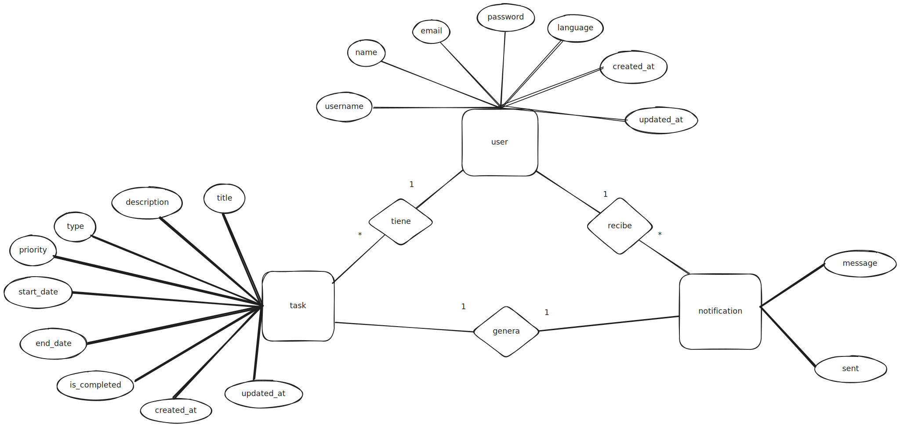
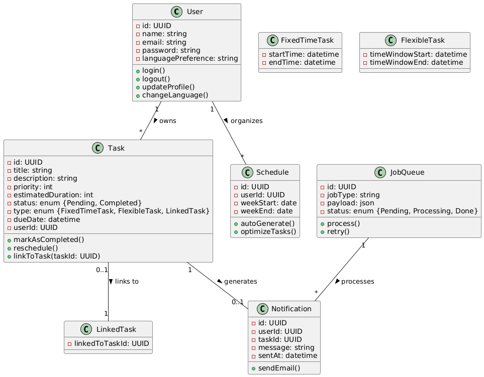

# ReSchedule

ReSchedule es una herramienta web para organizar y gestionar horarios de manera automática. Diseñada especialmente para estudiantes, permite configurar tareas con diferentes niveles de prioridad sin la necesidad de hacerlo manualmente.

La idea surgió al ver a familiares y amigos estudiantes organizando sus horarios manualmente con notas adhesivas o agendas. Con ReSchedule, este proceso se automatiza, ahorrando tiempo y esfuerzo.

## Objetivos

-   Organiza tu horario automáticamente
-   Personaliza tus tareas
-   Notificaciones vía email
-   Inicio de sesión
-   Soporte para múltiples idiomas

ReSchedule permite la creación y gestión de diferentes tipos de tareas:

-   **Tarea Importante**: Tareas con una hora fija (como exámenes o entrevistas).
-   **Tarea Pequeña**: Tareas que se pueden asignar dentro de intervalos de horas y se organizan por prioridad manualmente o vinculadas a otras.
-   **Tarea Vinculada**: Tareas relacionadas entre sí. Si una tarea tiene una fecha próxima y está vinculada a otra, se prioriza automáticamente.

## Tecnologías utilizadas

-   **Laravel**: Backend sólido con autenticación, rutas y lógica de negocio.
-   **Tailwind CSS**: Diseño rápido y eficiente sin necesidad de escribir mucho CSS.
-   **PostgreSQL**: Base de datos potente, ideal para consultas avanzadas y estructuras de datos complejas.
-   **Laravel Livewire**: Interactividad en tiempo real sin necesidad de escribir mucho JavaScript.
-   **blade**: Para componentes dinámicos y reactividad avanzada cuando sea necesario.
-   **Laravel Queue**: Procesamiento en segundo plano para emails y tareas automatizadas.
-   **Cron Jobs**: Automatización de la organización de tareas y recordatorios.

## Diagrama E/R

A continuación, se presentan las tablas que componen la base de datos del proyecto:

### **Usuarios**

| Atributo   | Tipo        | Descripción                         |
| ---------- | ----------- | ----------------------------------- |
| id         | bigint (PK) | ID único del usuario                |
| name       | string      | Nombre del usuario                  |
| email      | string      | Correo electrónico único            |
| password   | string      | Contraseña cifrada                  |
| language   | string      | Idioma preferido (‘es’, ‘en’, etc.) |
| created_at | timestamp   | Fecha de registro                   |
| updated_at | timestamp   | Última modificación                 |

### **Tareas**

| Atributo        | Tipo        | Descripción                      |
| --------------- | ----------- | -------------------------------- |
| id              | bigint (PK) | ID único de la tarea             |
| user_id         | bigint (FK) | Usuario que creó la tarea        |
| title           | string      | Título de la tarea               |
| description     | text        | Detalle de la tarea              |
| type_task_id    | bigint (FK) | ID del tipo de tarea asociada    |
| priority_id     | bigint (FK) | ID del nivel de prioridad        |
| start_date      | datetime    | Fecha/hora de inicio (nullable)  |
| end_date        | datetime    | Fecha/hora de fin (nullable)     |
| related_task_id | bigint (FK) | ID de otra tarea (nullable)      |
| completed       | boolean     | Si ya fue marcada como terminada |
| created_at      | timestamp   | Fecha de creación                |
| updated_at      | timestamp   | Última modificación              |

### **Tipos tarea**

| Atributo    | Tipo        | Descripción                        |
| ----------- | ----------- | ---------------------------------- |
| id          | bigint (PK) | ID único del tipo de tarea         |
| name        | string      | ‘importante’, ‘peque’, ‘vinculada’ |
| description | string      | Usuario destinatario               |

### **Prioridades**

| Atributo   | Tipo        | Descripción                       |
| ---------- | ----------- | --------------------------------- |
| id         | bigint (PK) | ID único del prioridad            |
| name       | string      | Nombre descriptivo (Alta, Media…) |
| color      | string      | Código de color para mostrarlo    |
| importance | int         | Número para ordenar prioridades   |

### **Group Task - User (Pivot Table)**

| Attribute     | Type        | Description                               |
| ------------- | ----------- | ----------------------------------------- |
| group_task_id | bigint (FK) | ID of the group task (references `tasks`) |
| user_id       | bigint (FK) | ID of the user participating in the task  |

### **Comments**

| Attribute     | Type        | Description                               |
| ------------- | ----------- | ----------------------------------------- |
| id            | bigint (PK) | Unique ID of the comment                  |
| group_task_id | bigint (FK) | ID of the group task (references `tasks`) |
| user_id       | bigint (FK) | Author of the comment                     |
| content       | text        | Content of the comment                    |
| created_at    | timestamp   | When it was created                       |
| updated_at    | timestamp   | When it was last updated                  |

### **Task Histories**

| Attribute    | Type        | Description                             |
| ------------ | ----------- | --------------------------------------- |
| id           | bigint (PK) | Unique ID of the task history entry     |
| user_id      | bigint (FK) | ID of the user who completed the task   |
| task_id      | bigint (FK) | ID of the completed task                |
| completed_at | timestamp   | Timestamp when the task was marked done |
| created_at   | timestamp   | Record creation timestamp               |
| updated_at   | timestamp   | Record last update timestamp            |

### **Notificaciones**

| Atributo | Tipo        | Descripción                 |
| -------- | ----------- | --------------------------- |
| id       | bigint (PK) | ID único de la notificación |
| task_id  | bigint (FK) | ID de la tarea asociada     |
| user_id  | bigint (FK) | Usuario destinatario        |
| message  | string      | Texto de la notificación    |
| sent_at  | timestamp   | Fecha de envío              |
| is_sent  | boolean     | Si ya fue enviado o no      |

## Ver el diagrama E/R

Aquí está el diagrama E/R de la base de datos:

## **Diagrama UML**

El siguiente diagrama UML representa la estructura y las relaciones dentro del proyecto **ReSchedule**:

### **Clases Clave y Relaciones**

-   **User**: Representa a la persona que usa el sistema.

    -   Puede **iniciar sesión**, **cerrar sesión** y **actualizar** su perfil.
    -   Cada usuario puede tener múltiples **Tasks** y un **Schedule**.

-   **Task**: Representa una tarea que el usuario necesita completar.

    -   Las tareas pueden ser de diferentes tipos: **FixedTimeTask**, **FlexibleTask** y **LinkedTask**.
    -   **FixedTimeTask** y **FlexibleTask** **heredan** de la clase **Task**, ya que ambas son tipos específicos de tarea pero comparten atributos y métodos comunes.

    -   **FixedTimeTask**: Una tarea que ocurre a una **hora específica**.
    -   **FlexibleTask**: Una tarea que se puede completar dentro de una **ventana de tiempo**, es decir, decides cuanto tiempo quieres dedicar en la tarea.

    -   **LinkedTask**: Una tarea que está vinculada a otra tarea y depende de su estado.

-   **Schedule**: Representa todo el horario del usuario, que incluye una lista de tareas organizadas a lo largo de la semana.

    -   Puede **auto-generar** y **optimizar** las tareas.

-   **Notification**: Envía notificaciones a los usuarios (por ejemplo, recordatorios de tareas).

    -   Las notificaciones son activadas por las **tareas** y enviadas por **correo electrónico**.

    -   Las notificaciones ahora también alertan a los usuarios cuando una tarea grupal es modificada.

-   **JobQueue**: Maneja las tareas en segundo plano, como el envío de correos electrónicos y la programación de tareas.

    -   Realiza el seguimiento de los trabajos con estados como **Pending** (Pendiente), **Processing** (En proceso) y **Done** (Hecho).

-   **DragAndDropService**

    -   Servicio encargado de permitir que el usuario reorganice sus tareas visualmente arrastrándolas en el calendario.  
        Utiliza **FullCalendar** para la interfaz y **Livewire** para guardar los cambios automáticamente.

-   **TaskHistory**

    -   Clase que almacena el historial de tareas completadas por cada usuario.  
        Sirve como base para generar estadísticas y evaluar la productividad.

-   **ProductivityStats**

    -   Clase dedicada a procesar datos del historial de tareas para generar estadísticas semanales o mensuales.  
        También permite crear rankings de productividad, como "semana más productiva".

-   **GroupTask (hereda de Task)**

    -   Representa una tarea colaborativa en la que participan varios usuarios.  
        Incluye relaciones con los participantes, comentarios y notificaciones asociadas.

-   **Comment**
    -   Se utiliza para añadir comentarios dentro de una `GroupTask`.  
        Permite la comunicación y coordinación entre los miembros del grupo.

### **Relaciones entre Clases**

-   Un **User** puede tener múltiples **Tasks**, un **Schedule**, múltiples **Notifications** y múltiples registros en **TaskHistory**.
-   Una **Task** puede generar una **Notification**.
-   Una **Task** puede estar **vinculada** a otra **Task** (clase **LinkedTask**).
-   **FixedTimeTask**, **FlexibleTask** y **GroupTask** son especializaciones de la clase **Task**.
-   El **JobQueue** procesa tareas en segundo plano, como el envío de **Notifications** y la automatización del **Schedule**.
-   Un **Schedule** genera y organiza múltiples **Tasks** de un **User**.
-   Una **GroupTask** puede estar asociada a múltiples **Users** (relación N:N).
-   Una **GroupTask** puede tener múltiples **Comments**.
-   Un **Comment** pertenece a una única **GroupTask**.
-   Un **User** puede completar múltiples **Tasks**, que se registran en **TaskHistory**.
-   **ProductivityStats** utiliza los datos de **TaskHistory** para generar estadísticas y rankings.
-   **DragAndDropService** gestiona el movimiento visual de **Tasks** dentro del calendario.

## Ver el diagrama UML

Aquí está el diagrama UML:

## Licencia

Este proyecto está bajo la licencia MIT. Consulta el archivo `LICENSE` para más detalles.
